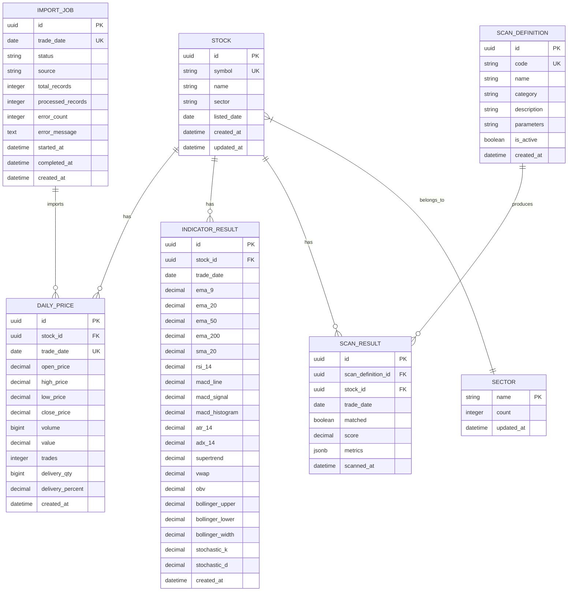

# ER Diagram

## Entity Relationship Diagram

```mermaid
erDiagram
    STOCK ||--o{ DAILY_PRICE : has
    STOCK ||--o{ INDICATOR_RESULT : has
    STOCK ||--o{ SCAN_RESULT : has
    STOCK }|--|| SECTOR : belongs_to
    IMPORT_JOB ||--o{ DAILY_PRICE : imports
    SCAN_DEFINITION ||--o{ SCAN_RESULT : produces

    STOCK {
        uuid id PK
        string symbol UK
        string name
        string sector
        date listed_date
        datetime created_at
        datetime updated_at
    }

    DAILY_PRICE {
        uuid id PK
        uuid stock_id FK
        date trade_date UK
        decimal open_price
        decimal high_price
        decimal low_price
        decimal close_price
        bigint volume
        decimal value
        integer trades
        bigint delivery_qty
        decimal delivery_percent
        datetime created_at
    }

    IMPORT_JOB {
        uuid id PK
        date trade_date UK
        string status
        string source
        integer total_records
        integer processed_records
        integer error_count
        text error_message
        datetime started_at
        datetime completed_at
        datetime created_at
    }

    INDICATOR_RESULT {
        uuid id PK
        uuid stock_id FK
        date trade_date
        decimal ema_9
        decimal ema_20
        decimal ema_50
        decimal ema_200
        decimal sma_20
        decimal rsi_14
        decimal macd_line
        decimal macd_signal
        decimal macd_histogram
        decimal atr_14
        decimal adx_14
        decimal supertrend
        decimal vwap
        decimal obv
        decimal bollinger_upper
        decimal bollinger_lower
        decimal bollinger_width
        decimal stochastic_k
        decimal stochastic_d
        datetime created_at
    }

    SCAN_DEFINITION {
        uuid id PK
        string code UK
        string name
        string category
        string description
        string parameters
        boolean is_active
        datetime created_at
    }

    SCAN_RESULT {
        uuid id PK
        uuid scan_definition_id FK
        uuid stock_id FK
        date trade_date
        boolean matched
        decimal score
        jsonb metrics
        datetime scanned_at
    }

    SECTOR {
        string name PK
        integer count
        datetime updated_at
    }
```
